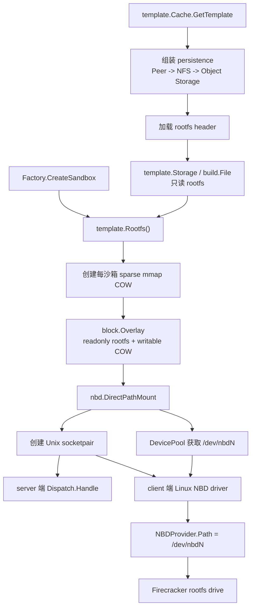
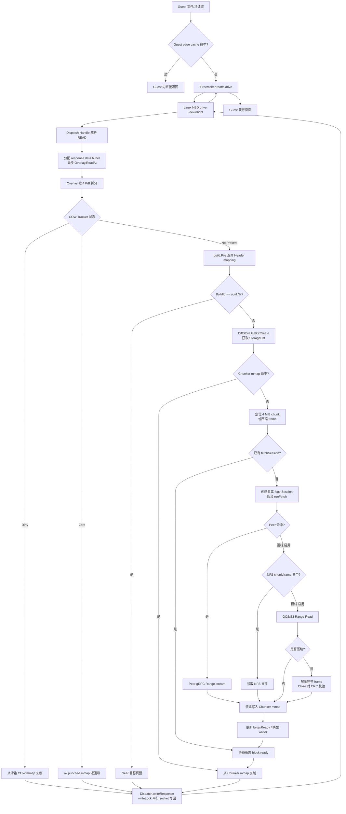
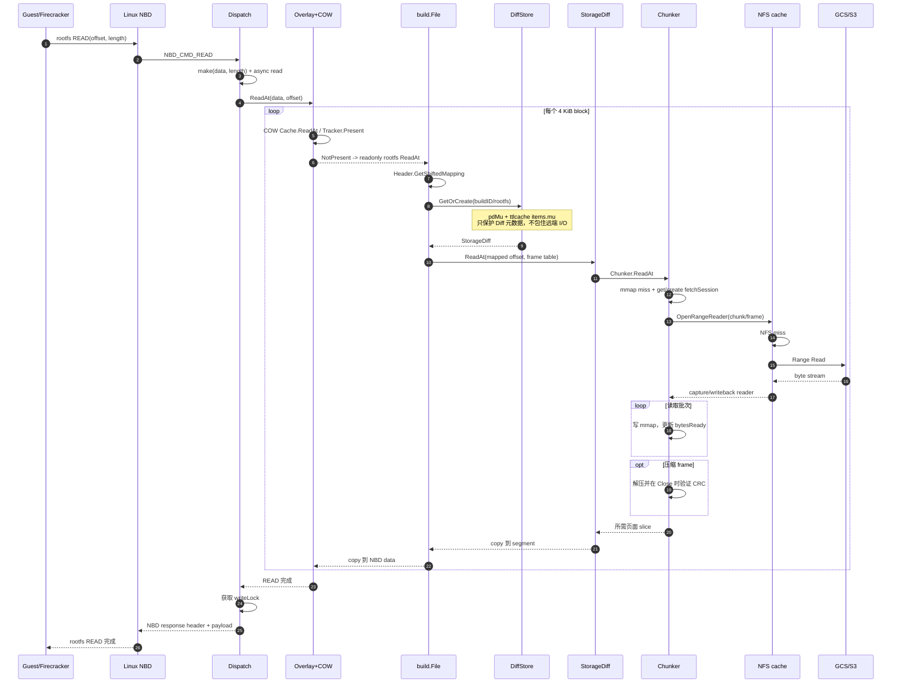

# E2B NBD rootfs 页面获取全流程

本文基于仓库当前代码梳理 NBD rootfs 的初始化、读请求、缓存命中、冷页拉取、响应写回与并发控制流程。分析基线为本地 `main` 分支提交 `040a85bb4`。

> 本文中的“页面”主要指 rootfs 的 4 KiB block。Linux NBD 一次 READ 可以包含多个 block，但 `Overlay.ReadAt` 会再次按 rootfs block size 拆分处理。

## 1. 先明确边界

- NBD 只负责 rootfs 块设备；memfile 由 UFFD 路径提供，不会映射成 NBD rootfs 设备。
- rootfs 和 memfile 在更下层共享 `template.Storage -> build.File -> DiffStore -> StorageDiff -> Chunker` 这套只读 artifact 存储引擎。
- `Dispatch` 不直接访问 GCS、S3、NFS 或 Peer。它只调用 `Overlay.ReadAt`；真正的远端 I/O 发生在 `Chunker` 调用 `RangeOpener.OpenRangeReader` 时。
- `ttlcache` 缓存的是 `StorageDiff` 对象，不是页面字节。实际字节缓存位于 COW mmap、Chunker mmap 和可选的 NFS 文件缓存中。

## 2. 核心对象和缓存层次

| 层次 | 生命周期/作用域 | 缓存内容 | 命中后的行为 |
|---|---|---|---|
| Guest page cache | VM 内核 | 文件页、块页 | 不产生宿主机 NBD 请求 |
| 沙箱 COW `block.Cache` | 每个沙箱 | rootfs 写入、TRIM/WRITE_ZEROES 状态 | 从 sparse mmap 复制到 NBD READ buffer |
| `DiffStore` | orchestrator 进程级共享 | `buildID/fileType -> Diff` 对象 | 返回已有 `StorageDiff`；不保存具体页面字节 |
| Chunker `block.Cache` | 每个 `StorageDiff` | 只读 ancestor artifact 的解压后字节 | 从本地 mmap 复制给 `build.File` |
| NFS cache（可选） | 多进程/节点共享目录 | 无压缩 4 MiB chunk 或压缩 frame 原始字节 | 流式读入 Chunker mmap |
| Peer（可选） | 远端 orchestrator | 尚未完成对象存储上传的 artifact 流 | gRPC 流式读入 Chunker mmap |
| GCS/S3/本地 provider | 持久存储 | artifact 对象 | Range Read；压缩对象按 frame 拉取并解压 |

缓存层级可概括为：

```mermaid
flowchart LR
    GP["Guest page cache"] -->|miss| NBD["Linux NBD /dev/nbdN"]
    NBD --> COW["Sandbox COW mmap<br/>Dirty / Zero / NotPresent"]
    COW -->|NotPresent| DS["DiffStore<br/>StorageDiff 元数据"]
    DS --> MM["Chunker mmap<br/>解压后 artifact 字节"]
    MM -->|miss| PEER["Peer gRPC<br/>可选"]
    PEER -->|miss 或已上传| NFS["NFS cache<br/>可选"]
    NFS -->|miss| OBJ["GCS / S3 / Local"]

    COW -. "命中后直接返回" .-> NBD
    MM -. "命中后复制返回" .-> DS
```



## 3. 初始化与挂载流程

### 3.1 构造只读 rootfs

`template.Cache.GetTemplate` 先确定持久存储包装顺序：

1. 基础 provider 是 GCS、S3 或本地文件存储。
2. NFS cache 开启时，用 `storage.WrapInNFSCache` 包装基础 provider。
3. Peer-to-peer 开启时，再用 `peerclient.NewRoutingProvider` 包在最外层。

因此启用全部能力时，读取优先级是：

```text
Peer -> NFS -> GCS/S3
```

模板初始化线程加载 rootfs header，然后调用 `template.NewStorage`，最终创建：

```text
template.Storage
  └── build.File
        ├── header.Header：逻辑 offset 到 ancestor build/offset 的映射
        ├── 进程共享 DiffStore
        └── persistence：Peer/NFS/对象存储组合 provider
```

### 3.2 为沙箱创建 NBD Overlay

`Factory.CreateSandbox` 从模板取得只读 rootfs，然后调用 `rootfs.NewNBDProvider`：

1. 按 rootfs size/block size 创建每沙箱独立的 sparse mmap COW cache。
2. 用 `block.NewOverlay(readonlyRootfs, cowCache)` 组合读写视图。
3. 用 `nbd.NewDirectPathMount(overlay, devicePool, flags)` 创建 NBD 后端。
4. 后台执行 `NBDProvider.Start`。

`DirectPathMount.Open` 随后：

1. 从 `DevicePool` 获取一个空闲 `/dev/nbdN`。
2. 按 `nbd-connections-per-device` 创建 Unix socketpair；当前 fallback 默认值为 1。
3. socket server 端运行一个 `Dispatch.Handle`。
4. socket client 端交给内核 NBD 驱动。
5. 通过 netlink `nbdnl.Connect` 配置 block size、设备大小、90 秒 I/O timeout、30 秒 dead-connection timeout，以及 multiconn、TRIM、WRITE_ZEROES 能力。
6. `NBDProvider.Path()` 发布 `/dev/nbdN`。
7. Firecracker 将该路径配置为可写 rootfs drive。



## 4. 一次 NBD READ 的完整流程

### 4.1 Guest 到 Dispatch

1. Guest 内文件系统读未被 Guest page cache 满足，Firecracker 对 rootfs drive 发起宿主机文件 I/O。
2. 该 drive 对应 `/dev/nbdN`，Linux NBD 驱动将 READ 命令写入 Unix socket。
3. `Dispatch.Handle` 从 `sync.Pool` 借用一个 4 MiB 解析 buffer，按 28 字节 NBD request header 解析：
   - magic
   - flags
   - command type
   - handle
   - offset
   - length
4. `cmdRead` 为该请求创建 `make([]byte, length)` 作为最终响应 payload。
5. READ 在异步 goroutine 中调用 `Overlay.ReadAt(ctx, data, offset)`；当前没有显式的 per-dispatch in-flight READ 上限。

### 4.2 Overlay：先查沙箱 COW

`Overlay.ReadAt` 把整个 NBD READ 按 rootfs block size 拆开。rootfs block size 当前是 4 KiB，因此逐 block 执行：

1. `cowCache.ReadAt` 获取 `Cache.mu.RLock`。
2. `Tracker.Present` 再以共享读锁检查页面状态：
   - `Dirty`：mmap 中有沙箱写入的数据；直接复制。
   - `Zero`：该范围曾被 TRIM/WRITE_ZEROES，mmap hole 读出零；直接复制。
   - `NotPresent`：返回 `BytesNotAvailableError`。
3. 只有 `NotPresent` 才调用只读 `template.Storage.ReadAt`。

注意：只读 rootfs 页面不会回填到沙箱 COW。它会缓存在下层 `StorageDiff` 的 Chunker mmap 中，使使用同一 `StorageDiff` 的读取复用。

### 4.3 build.File：解析页面属于哪个 ancestor

`template.Storage.ReadAt` 直接委托给 `build.File.ReadAt`。`build.File` 的职责不是下载，而是把逻辑 rootfs offset 转换成 artifact segment：

1. `Header.GetShiftedMapping` 查找当前 offset 对应的 `BuildId`、ancestor 内 offset 和连续长度。
2. `BuildId == uuid.Nil` 表示空洞，直接对目标 buffer `clear`。
3. 非空映射通过 `cachedBuild` 获取对应 `Diff`。
4. 单次 `build.File.ReadAt` 内有容量为 16 的小型 Diff cache，避免同一请求跨多个映射时反复进入进程级 `DiffStore`。
5. 映射规划完成后执行各个 read segment。`max-parallel-build-read-segments` 当前 fallback 默认值是 1，即默认串行执行。

由于 NBD Overlay 已经按 4 KiB 调用下层，普通 rootfs 页面读取通常只包含一个映射，单次读取的 16 项 Diff cache 很难跨相邻 NBD 页面复用。

### 4.4 DiffStore：获得或创建 StorageDiff

`build.File.getBuild` 使用 `buildID/fileType` 生成 `DiffStoreKey`，调用 `DiffStore.GetOrCreate`：

- 命中：直接返回已有 `StorageDiff`。
- miss：使用 `singleflight.Group` 按 key 合并并发初始化；二次检查后调用 `createDiff`，成功后放入 `ttlcache`。

`StorageDiff` 初始化会解析：

- artifact 路径；
- artifact 未压缩大小；
- 完整或局部 FrameTable；
- 当前 upstream 是 Peer wrapper、NFS wrapper 还是基础对象存储；
- 对应的本地 Chunker mmap cache 文件。

这里需要区分两个概念：

- `DiffStore/ttlcache`：缓存 `StorageDiff` 对象和生命周期元数据。
- `StorageDiff.chunker.cache`：缓存真正的 rootfs artifact 字节。

当前 `ttlcache v3.4.0` 的 `Get` 为更新 LRU 和滑动 TTL，会获取该 cache 的独占 `items.mu`。`DiffStore.GetOrCreate` 前还调用 `resetDelete`，会短暂获取 `pdMu`。这些锁会串行化进程级 Diff 元数据查询，但锁在 Chunker 和远端读取前已经释放，不会包住网络下载。

### 4.5 StorageDiff：确定 upstream 和压缩布局

`StorageDiff.ReadAt`：

1. 检查 artifact 是否被 soft-delete。
2. 将调用方 header 中的 FrameTable 与当前 source 状态解析成一致的 `{upstream, frameTable}` 快照。
3. 调用 `Chunker.ReadAt`。
4. 如果 Peer 在读取过程中通知 artifact 已上传，捕获 `PeerTransitionedError`，等待对方建议的 backoff，重新加载权威 header/source，再重试 Chunker 读取。

### 4.6 Chunker：查 mmap，miss 后合并下载

`Chunker.ReadAt` 先调用 `Chunker.Slice`：

1. **mmap 命中**：`cache.Slice` 返回已有字节，直接复制到 build segment。
2. **mmap miss**：确定 fetch 边界：
   - 无压缩 artifact：按 4 MiB `MemoryChunkSize` 对齐。
   - 压缩 artifact：由 FrameTable 决定一个压缩 frame 对应的未压缩范围。
3. 在 `fetchMu` 下查找覆盖该范围的 `fetchSession`。
4. 已有 session：加入等待，不重复下载。
5. 没有 session：创建 session，并启动后台 `runFetch`。

fetch goroutine 使用 `context.WithoutCancel` 脱离首个请求的 cancel，但自身有 60 秒 timeout。这样首个 waiter 取消时，共享下载仍可继续服务其他 waiter。

### 4.7 选择实际数据源

`runFetch -> progressiveFetch -> upstream.OpenRangeReader` 最终选择数据源。

启用 Peer 和 NFS 时，完整优先级为：

1. **Peer**：通过 gRPC `ReadAtBuildSeekable` 流式获取。Peer miss 时落到 base；Peer 表示已经上传时触发 source/header 切换。
2. **NFS cache**：
   - 无压缩：查找 offset 对应的 chunk `.bin` 文件。
   - 压缩：查找压缩空间 offset 对应的 `.frm` 文件，校验文件大小后解压。
3. **GCS/S3**：使用 Range Read：
   - 无压缩：直接读取 4 MiB chunk 对应范围。
   - 压缩：通过 FrameTable 找到压缩空间范围，只读取对应 frame，并使用 LZ4/Zstd reader 解压。
4. NFS miss 且远端读取完整成功时，capture reader 在后台把原始 chunk/frame 回写到 NFS。写入使用按目标路径的 try-lock 和临时文件 rename，失败不影响本次已经获得的数据。

### 4.8 流式填充与 waiter 唤醒

数据通过 RangeReader 写入 Chunker 的 mmap：

- 每次读取批量大小是 `max(blockSize, min-chunker-read-size-kb)`；当前 fallback 是 `max(4 KiB, 16 KiB) = 16 KiB`。
- 无压缩 chunk 每完成一个批次就推进 `bytesReady` 并广播；请求页面被覆盖后，其 waiter 可以在完整 4 MiB chunk 下载结束前返回。
- 压缩 frame 必须完整读取并在 `RangeReader.Close` 时消费 footer、通过 CRC/截断校验，之后才会释放 waiter，避免暴露后来被证明损坏的数据。
- 完整 fetch 成功后，`setIsCached` 把整个 chunk/frame 标为本地可用，然后结束 session。

### 4.9 返回 NBD 响应

数据沿原调用链返回：

```text
Chunker mmap
  -> StorageDiff.ReadAt
  -> build.File segment buffer
  -> Overlay 的 NBD READ data buffer
  -> Dispatch.writeResponse
  -> Unix socket
  -> Linux NBD driver
  -> Firecracker rootfs drive
  -> Guest block/filesystem read
```

`Dispatch.writeResponse` 持有每个 Dispatch 独立的 `writeLock`，确保 16 字节响应 header 和 payload 不与其他响应交错。当前默认每个设备只有一个 NBD connection，因此同一沙箱的响应 socket 写回默认经过同一个 `writeLock`。

## 5. 总体读路径 Mermaid 图



## 6. 冷页 miss 时序图

下面展示一个 COW miss、Chunker miss、NFS miss、最终由对象存储提供数据的请求。Peer 未启用或未命中。



## 7. 并发和锁的实际作用域

| 位置 | 并发语义 | 是否包住远端 I/O |
|---|---|---|
| `Dispatch.Handle` | 单连接串行解析 request；READ/WRITE 可异步执行 | 否 |
| READ `data` buffer | 每请求单独分配；当前无显式 in-flight 上限 | 贯穿完整请求，但不是锁 |
| `Dispatch.writeLock` | 每连接串行写 response header + payload | 可能在 socket write 阻塞，但不包住页面获取 |
| `Overlay.ReadAt` | 一个请求内按 4 KiB block 顺序读取 | 间接：每个 block miss 都等待下层 |
| COW `Cache.mu` | READ 用 `RLock`，WRITE/ZERO/CLOSE 用 `Lock` | 否 |
| COW `Tracker.mu` | 状态查询用 `RLock`，状态变更用 `Lock` | 否 |
| `DiffStore.pdMu` | 每次 GetOrCreate 先短暂取消待删除状态 | 否 |
| `ttlcache.items.mu` | 命中也以独占锁更新 LRU/TTL | 否；锁释放后才创建/读取 Diff |
| `singleflight` | 只合并同一个 DiffStoreKey 的初始化 | 初始化可能访问存储元数据，但不同 key 不互斥 |
| `build.File.readSegments` | fallback 默认并行度 1 | 可能，segment 自身会进入 Chunker |
| `Chunker.fetchMu` | 短暂查找/创建 fetch session | 否 |
| `fetchSession` | 相同 chunk/frame 的 miss 合并成一次 fetch | 是共享同一次 I/O，不是全局串行 |
| NFS writeback lock | 按目标 cache 文件 try-lock，避免重复写回 | 只保护后台本地/NFS 写文件 |

关键判断：


因此，`ttlcache` 会形成进程级 Diff 元数据查询临界区，但不能把它描述为“页面网络下载全程持有全局写锁”。网络 I/O 位于锁外；相同 chunk/frame 被有意合并，不同 chunk/frame 可以由不同请求并发拉取。

## 8. 热页、冷页和零页的最短路径

### 8.1 沙箱 COW 热页

```text
NBD -> Dispatch -> Overlay -> COW mmap -> Dispatch response
```

不会进入 Header、DiffStore、Chunker 或远端存储。

### 8.2 共享 rootfs 热页

```text
NBD -> Dispatch -> Overlay COW miss -> build mapping
    -> DiffStore hit -> Chunker mmap hit -> Dispatch response
```

会查询 DiffStore 元数据，但不会访问 NFS/Peer/GCS/S3。

### 8.3 共享 rootfs 冷页

```text
NBD -> Dispatch -> Overlay COW miss -> build mapping
    -> DiffStore -> Chunker mmap miss -> fetchSession
    -> Peer/NFS/Object Storage -> Chunker mmap -> Dispatch response
```

无压缩数据可在所需 block ready 后提前返回；压缩 frame 要等待完整 frame 校验成功。

### 8.4 uuid.Nil 空洞页

```text
NBD -> Dispatch -> Overlay COW miss -> build mapping -> clear(page) -> response
```

不会创建 StorageDiff，也不会访问远端。

### 8.5 TRIM/WRITE_ZEROES 后的零页

TRIM 和 WRITE_ZEROES 会对 COW mmap punch hole，并在 Tracker 中标记 `Zero`。后续 READ 在 Overlay COW 层命中零页，不再回落到只读 rootfs。

## 9. 超时、错误和恢复

- Chunker 单次 fetch timeout：60 秒。
- Linux NBD per-request timeout：90 秒，预留时间让 60 秒 backend fetch 失败后仍可返回错误。
- NBD dead-connection timeout：30 秒。
- backend `ReadAt` 失败：`Dispatch` 返回 NBD error response；只要 socket 仍可写，Dispatch loop 继续服务。
- response socket write 失败：作为 fatal error 终止对应 Dispatch。
- Chunker mmap 发生 memory fault：`RunFaultSafe` 将 fault 转换成当前请求错误，避免直接终止进程。
- `StorageDiff` 在读取中被 cache eviction 关闭：`build.File` 重新 plan 并解析新的 Diff。
- Peer 从“可读”切换到“已上传”：刷新权威 header/source 后重试。
- 压缩 NFS frame 大小错误或 CRC/解压错误：删除损坏 cache frame，后续读取重新拉取。

## 10. 当前值得关注的性能点

1. `Overlay.ReadAt` 对一个较大的 NBD READ 仍按 4 KiB 串行调用下层；连续 COW miss 会重复经过 mapping 和 DiffStore 路径。
2. `DiffStore.GetOrCreate` 的 `pdMu` 和 `ttlcache` 独占锁仍是进程级元数据竞争点。
3. `build.File` 的 16 项 per-read Diff cache 能优化一个 `ReadAt` 内的多 mapping 读取，但 Overlay 的 4 KiB 拆分削弱了它在 NBD rootfs 连续读中的收益。
4. `cmdRead` 每请求分配完整 payload，并创建异步 goroutine；当前没有显式在途请求数量/字节数限制。
5. 默认只有一个 NBD connection，所有 response write 默认经过同一 `writeLock`。增加连接数能提供更多 socket 级并行度，但会增加 socket、Dispatch 和 4 MiB parser buffer 的活跃资源占用。
6. 无压缩冷页的首次返回粒度默认至少是 16 KiB，不是严格的 4 KiB；后台仍会把整个 4 MiB chunk 拉完并缓存。
7. 压缩减少网络和 NFS 原始字节，但冷页必须等待完整 frame 解压和 CRC 校验。

上述 feature flag 数值都是代码 fallback，运行环境可通过特性配置覆盖。

## 11. 关键代码索引

| 环节 | 文件/函数 |
|---|---|
| 沙箱创建 NBD rootfs | [`packages/orchestrator/pkg/sandbox/sandbox.go`](../packages/orchestrator/pkg/sandbox/sandbox.go) `Factory.CreateSandbox` |
| rootfs COW + NBD Provider | [`packages/orchestrator/pkg/sandbox/rootfs/nbd.go`](../packages/orchestrator/pkg/sandbox/rootfs/nbd.go) `NewNBDProvider`, `Start`, `Path` |
| `/dev/nbdN`、socketpair、netlink connect | [`packages/orchestrator/pkg/sandbox/nbd/path_direct.go`](../packages/orchestrator/pkg/sandbox/nbd/path_direct.go) `DirectPathMount.Open` |
| NBD request 解析、READ 和响应 | [`packages/orchestrator/pkg/sandbox/nbd/dispatch.go`](../packages/orchestrator/pkg/sandbox/nbd/dispatch.go) `Handle`, `cmdRead`, `writeResponse` |
| Overlay COW-first 读取 | [`packages/orchestrator/pkg/sandbox/block/overlay.go`](../packages/orchestrator/pkg/sandbox/block/overlay.go) `Overlay.ReadAt` |
| COW/Chunker mmap cache | [`packages/orchestrator/pkg/sandbox/block/cache.go`](../packages/orchestrator/pkg/sandbox/block/cache.go) `Cache.ReadAt`, `Slice`, `WriteZeroesAt` |
| Dirty/Zero 状态 | [`packages/orchestrator/pkg/sandbox/block/tracker.go`](../packages/orchestrator/pkg/sandbox/block/tracker.go) `Tracker` |
| rootfs Storage 包装 | [`packages/orchestrator/pkg/sandbox/template/storage.go`](../packages/orchestrator/pkg/sandbox/template/storage.go) `NewStorage` |
| Header mapping 和 segment 规划 | [`packages/orchestrator/pkg/sandbox/build/build.go`](../packages/orchestrator/pkg/sandbox/build/build.go) `File.ReadAt`, `planRead`, `getBuild` |
| 进程级 Diff 缓存 | [`packages/orchestrator/pkg/sandbox/build/cache.go`](../packages/orchestrator/pkg/sandbox/build/cache.go) `DiffStore.GetOrCreate` |
| upstream/FrameTable/Peer transition | [`packages/orchestrator/pkg/sandbox/build/storage_diff.go`](../packages/orchestrator/pkg/sandbox/build/storage_diff.go) `StorageDiff.ReadAt`, `createDiff` |
| Chunk 定位、下载合并和渐进唤醒 | [`packages/orchestrator/pkg/sandbox/block/streaming_chunk.go`](../packages/orchestrator/pkg/sandbox/block/streaming_chunk.go) `Chunker.Slice`, `fetch`, `runFetch` |
| fetch waiter | [`packages/orchestrator/pkg/sandbox/block/fetch_session.go`](../packages/orchestrator/pkg/sandbox/block/fetch_session.go) `fetchSession` |
| NFS cache | [`packages/shared/pkg/storage/storage_cache_seekable.go`](../packages/shared/pkg/storage/storage_cache_seekable.go), [`storage_cache_seekable_compressed.go`](../packages/shared/pkg/storage/storage_cache_seekable_compressed.go) |
| Peer routing | [`packages/orchestrator/pkg/sandbox/template/peerclient/storage.go`](../packages/orchestrator/pkg/sandbox/template/peerclient/storage.go), [`seekable.go`](../packages/orchestrator/pkg/sandbox/template/peerclient/seekable.go) |
| GCS/S3 Range Read | [`packages/shared/pkg/storage/storage_google.go`](../packages/shared/pkg/storage/storage_google.go), [`storage_aws.go`](../packages/shared/pkg/storage/storage_aws.go) |
| 默认并发/批量参数 | [`packages/shared/pkg/featureflags/flags.go`](../packages/shared/pkg/featureflags/flags.go) |
