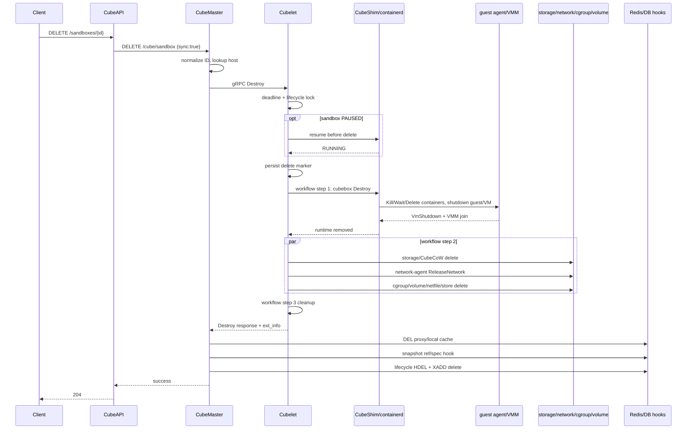

# 沙箱销毁流程梳理与高并发性能分析

## 1. 主流程时序



## 2. 阶段一：CubeAPI

1. Axum handler 收到 `DELETE /sandboxes/:sandboxID`；
2. service 构造 requestID、instance type，并固定 `sync=true`；
3. reqwest 向 CubeMaster 发 `DELETE /cube/sandbox`；
4. 等待 Master 完整完成，成功后返回 204。

关键位置：

- `CubeAPI/src/handlers/sandboxes.rs:191-233`
- `CubeAPI/src/services/sandboxes.rs:293-314`
- `CubeAPI/src/cubemaster/mod.rs:75-89`

性能含义：CubeAPI 标准 30 秒 route timeout 覆盖整个同步过程。API 自身通常不是重 CPU 阶段，但连接池、认证中间件、日志和超时会进入外部总时延。

## 3. 阶段二：CubeMaster 定位并调用 Cubelet

`DestroySandbox()` 完成：

1. 校验/规范化 sandbox ID；
2. 构造 `DestroyCubeSandboxRequest`，写 kill reason 和可选内存采集配置；
3. 从本地 sandbox cache 或 Redis proxy map 查 HostIP；
4. 得到 Cubelet endpoint；
5. sync=true 时直接 gRPC Destroy，不进入异步队列。

关键位置：`CubeMaster/pkg/service/sandbox/sandbox_remove.go:29-124,151-177`。

gRPC client 获取连接后构造 30 秒 timeout，完成后 Close wrapper（`CubeMaster/pkg/cubelet/actions.go:22-34`）。

### Master 的两种销毁并发模型

- 同步外部路径：每个 HTTP 请求直接调用 Cubelet，不受 `destroy_concurent_limit` 控制；
- 异步内部路径：进入 QueueWorker，再受 Destroy handler limiter 和 scheduler 动态并发控制。

所以对外高并发 DELETE 可能把突发直接传到单节点 Cubelet。若目标是保护节点，需要明确是在 CubeAPI/Master 做排队/限流，还是保留快速失败语义。

## 4. 阶段三：Cubelet 前置状态处理

Cubelet service：

1. 创建 DestroyContext 和总耗时 trace；
2. 读取 sandbox/namespace/runtime；
3. 建立 destroy deadline；
4. 对 Cube runtime 获取 keyed lifecycle lock，最多等待 2 秒；
5. 加锁后重新读取状态，避免 pause/delete 竞态；
6. 若为 PAUSED，先自动 resume；
7. resume 成功后持久化 RUNNING，并为 cleanup/response 预留 deadline；
8. 写 `UserMarkDeletedTime` 和 DeleteRequestID；
9. 调 workflow engine Destroy。

关键位置：`Cubelet/services/cubebox/service.go:501-697`、`delete_resume.go:19-225`。

### 暂停沙箱特殊成本

默认 30 秒预算被设计为：最多 5 秒 resume、约 20 秒 cleanup、5 秒 response reserve。暂停态删除不是单纯资源释放，而是“恢复 VM 后再走正常销毁”。因此必须单列指标和基准。

## 5. 阶段四：workflow step 1 —— `cubebox`

`Cubelet/services/cubebox/destroy.go:42-173` 的主要顺序：

1. 获取 sandbox 对象并持有该对象锁；
2. 标记 Removing；
3. 可选采集内存峰值；
4. 执行 CBRI DestroySandbox（当前 cube runtime plugin 实现为空操作）；
5. 收集 lifetime metric；
6. 遍历业务 containers，再追加 sandbox/first container；
7. 对每个 container **串行**执行 `destroyContainer()`；
8. 清 runc 文件；
9. defer 删除 Cubelet cubebox manager 中的 sandbox 对象。

### 单个 container 的运行时清理

`destroyContainer()` 顺序：

1. 可选退出前 exec；
2. preStop HTTP hook；
3. postStop HTTP hook；
4. `stopTask()`：Task lookup → SIGKILL → Wait → Delete；
5. `container.Delete(WithSnapshotCleanup)`；
6. CleanRootfs；
7. 清 FIFO/taskio。

其中 hooks 各自可等待配置的 timeout，是明显长尾来源。

### Shim/VM 结束

containerd Task Delete 进入 CubeShim `delete()`：

- `delete_container()` 内部再次执行 `destroy_container()`；
- 后者会再次尝试 SIGKILL；已停止状态下对 SIGKILL 会快速成功；
- 当 sandbox 为空，Shim shutdown 调 `destroy_sandbox()`；
- guest agent Destroy RPC 最长 200ms；
- 等待 VmShutdown event 单次最长 1000ms；
- 等 VMM `join()`。

关键位置：

- `CubeShim/shim/src/service/task_srv.rs:279-456`
- `CubeShim/shim/src/container/mod.rs:685-693`
- `CubeShim/shim/src/sandbox/sb.rs:646-713,1025-1043`
- `agent/src/rpc.rs:1406-1429`

## 6. 阶段五：workflow step 2 —— 节点资源并行清理

第一阶段完成后，以下 action 同时启动：

| action | 实际工作 | 潜在共享竞争 |
|---|---|---|
| images | 当前 Destroy 为空操作 | 很小。 |
| storage | 读 metadata；删 CubeCoW/default-medium；detach plugin volumes；删 metadata | CubeCoW 全局 name index 写锁、目录 fsync、磁盘元数据、volumeID 锁、外部 plugin。 |
| cgroup | pool.Put + DB delete | cgroup pool、Bolt/store writer。 |
| network | keyed lock；同步 network-agent ReleaseNetwork；allocation DeleteSync | network-agent 内部锁/eBPF map、持久化 store。 |
| volume | legacy volume lifetime 引用更新 | lifetime store/后台处理。 |
| netfile | RemoveAll 两个目录 | VFS/目录锁；默认配置已禁 legacy host netfile 时通常较轻。 |
| cube-sandbox-store | containerd sandbox store Delete | containerd metadata/Bolt。 |

同一沙箱的第二阶段耗时由最慢 action 决定；不同沙箱之间会在这些共享资源上竞争。

### CubeCoW 值得优先验证

`delete_volume()` 在全局 `name_index.write()` 锁内完成：

- 类型检查；
- 扫描 live snapshots；
- `remove_file`；
- 可选 `remove_dir`；
- `fsync_dir(volumes_dir)`；
- 更新 index/metric。

位置：`cubecow/src/engine/reflink.rs:421-488`。

这意味着同一 CubeCoW engine 上的并发 volume 删除可能被全局写锁串行化，而且把磁盘 fsync 包在临界区内。它是代码层面可见的高并发瓶颈候选，但仍需用 lock wait/fsync 埋点验证，不能仅凭代码断言它就是当前最大耗时。

### plugin volume

同一 volumeID 的 Attach/Detach 被 per-volume lock 串行（`Cubelet/plugins/volume/manager.go:168-211`）。不同沙箱共享同一外部卷时，高并发销毁会在这里形成队列，并同步调用 binary/RPC plugin。

## 7. 阶段六：workflow step 3 和 Master 收尾

Cubelet 最后执行 cleanup 插件，删除 GC/failover 本地 sandbox 信息，然后返回带 ext_info 的 response。

Master 收到成功后仍同步执行：

1. 应用 volume refcount transition；
2. Redis DEL sandbox proxy key（含兼容 key 时可能多个 DEL）；
3. 删除 Master 本地 sandbox cache；
4. 顺序运行 after-destroy hooks。

默认已注册的 hooks 至少包括：

- templatecenter：释放 snapshot runtime refs、删除 sandbox spec（DB）；
- lifecycle：Redis HDEL meta，再 XADD delete event。

hooks 按注册顺序串行且不短路（`CubeMaster/pkg/service/sandbox/runtime_ref_hook.go:23-67`）。因此即使 Cubelet 已完成，慢 DB/Redis 仍会抬高用户 DELETE 时延。

## 8. 高并发下的限制和瓶颈候选

### 已由代码确认的限制

1. Cubelet destroy workflow 默认最多 100 in-flight，超限立即失败，不排队。
2. 外部同步 DELETE 不经过 Master 异步销毁 limiter。
3. 每个 sandbox 内多 container 清理串行。
4. workflow step 2 虽并行，但 storage/network 等同步完成后才返回。
5. CubeCoW delete_volume 持全局 index 写锁执行 fsync。
6. Master after-destroy hooks 串行并位于用户响应之前。
7. 外部/CubeMaster 标准 deadline 为 30 秒。

### 需要实验验证的瓶颈假设

| 优先级 | 假设 | 验证指标 |
|---|---|---|
| P0 | CubeCoW 全局写锁 + fsync 导致并发越高 storage P99 线性上升 | storage action、lock wait、fsync duration、iowait。 |
| P0 | Shim 等 VmShutdown/join 形成 200ms/1s 级尾部台阶 | guest RPC、wait_notify、join 分段和 Shim 日志。 |
| P0 | network-agent ReleaseNetwork 成为 step2 关键路径 | network action、agent RPC duration、agent pprof/CPU。 |
| P1 | containerd/Bolt metadata 写事务在高并发下串行 | del-task、del-metadata、block/mutex profile。 |
| P1 | Master DB/Redis hooks 抬高 Cubelet 完成后的尾延迟 | `E2E - Cubelet service` 差值、各 hook duration。 |
| P1 | pre/postStop 或退出前 exec 污染默认销毁分布 | 按模板/hook 配置分组，查看 prestop/poststop keys。 |
| P2 | 日志量在 debug/high concurrency 下造成磁盘争用 | info vs debug A/B、日志写 CPU/iowait。 |

## 9. 优化方向（按实施顺序）

### 第一阶段：先补基准和分段

1. 增加预创建 + barrier 的 delete-only benchmark；
2. 对运行态/暂停态分开；
3. 为 CubeShim guest RPC、wait shutdown、join 增加 duration；
4. 为 CubeCoW lock wait/unlink/fsync 增加指标；
5. 为 Master proxy cleanup、snapshot hook、lifecycle hook 分段；
6. 在内部调试/benchmark 路径打通 Cubelet ext_info 与外部样本的 requestID 关联。

这是优化前置条件，否则无法知道改动作用于哪个阶段。

### 第二阶段：针对已证实的关键路径

可能方向，需基准证明后选择：

- CubeCoW：缩小 name_index 写锁临界区；避免在全局锁内 fsync；评估批量/异步 durability 策略，但必须保持 crash consistency；
- Shim：消除重复或无效 Kill RPC，优化 guest graceful shutdown 与 VmShutdown event 协议，避免固定超时尾巴；
- storage：同一沙箱多卷可控并行删除；plugin volume 维持 per-volume 正确性锁；
- network：ReleaseNetwork 批处理、内部并行或把非关键的本地回收移出同步关键路径；必须保证 ID/地址不会过早复用；
- Master hooks：将互不依赖的 hook 并行，或把非响应必需的事件发布异步化；DB 引用正确性和路由不可达语义必须先定义清楚；
- admission：在 CubeAPI/Master 增加按节点的可观测排队/背压，避免请求直接撞上 Cubelet TryAcquire 后失败。

### 第三阶段：容量和回归

每项优化必须验证：

- P50/P95/P99/max 和吞吐；
- 1~120 并发的成功率/饱和点；
- 删除后无 VM/shim/TAP/cgroup/volume/Redis route 泄漏；
- 重复 DELETE 幂等；
- pause/delete、rollback/delete、timeout/delete 竞态；
- Cubelet/Master 重启后的清理恢复；
- 单节点和多节点结果。

## 10. 推荐的第一轮实验

1. 固定所有沙箱到同一节点，默认模板，预创建 100 个 RUNNING 沙箱；
2. 并发档位 1/10/20/50/80/100，各跑 5 轮；
3. 同时采集 cube-bench、Cubelet ext_info/stat、Prometheus、Cubelet pprof、iostat；
4. 从每档挑 P50 和 P99 样本，用 sandboxID 对齐 CubeShim/CubeCoW/network-agent 日志；
5. 计算：

```text
Master/API tail ~= client DELETE - Cubelet cubebox-service
runtime phase = cubebox
resource phase ~= max(storage, network, cgroup, volume, netfile, store)
node tail ~= cleanup + service framing
```

6. 若 storage 随并发显著上升，再补 CubeCoW lock/fsync 埋点；若 cubebox 出现 1s 台阶，先补 Shim shutdown 分段；若 network 主导，转查 network-agent。

这条路线能最快把“方向调研”收敛为一个有数据支持的首个优化点。
