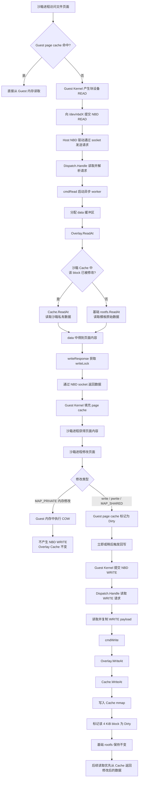

# 核心组件解析：Overlay 与数据生命周期

## 目录
- [1. Overlay 是什么](#1-overlay-是什么)
  - [1.1 读取与写入逻辑](#11-读取与写入逻辑)
- [2. 页面读取与修改流程](#2-页面读取与修改流程)
  - [2.1 第一次读取页面](#21-第一次读取页面)
  - [2.2 修改页面](#22-修改页面)
  - [2.3 修改后的再次读取](#23-修改后的再次读取)
- [3. data 缓冲区的生命周期](#3-data-缓冲区的生命周期)
- [4. 能否直接借用 Overlay 中的页面？](#4-能否直接借用-overlay-中的页面)
  - [4.1 沙箱修改过的页面](#41-沙箱修改过的页面)
  - [4.2 没有修改过的页面](#42-没有修改过的页面)
  - [4.3 直接借用 Overlay 页面的问题](#43-直接借用-overlay-页面的问题)
- [5. 更现实的优化方案](#5-更现实的优化方案)
  - [5.1 方案一：复用 READ buffer（优先推荐）](#51-方案一复用-read-buffer优先推荐)
  - [5.2 方案二：增加在途内存限制](#52-方案二增加在途内存限制)
  - [5.3 方案三：Overlay Slice 快路径](#53-方案三overlay-slice-快路径)
  - [5.4 推荐实施顺序](#54-推荐实施顺序)

## 1. Overlay 是什么

这里的 `Overlay` 是一个自定义的“块设备写时复制层（Copy-on-Write）”，不是 Linux 的 OverlayFS。

它把两个块设备组合成一个可写虚拟磁盘：

```text
Overlay
├── rootfs：只读基础镜像
└── cache：当前沙箱的可写差异层
```

完整关系是：

```text
沙箱里的 /dev/nbdX
        ↓
Dispatch
        ↓
Overlay
   ├─ cache：沙箱修改过的数据
   └─ rootfs：原始模板数据
```

### 1.1 读取与写入逻辑

读取逻辑可以简化为：读取一个 block -> cache 中存在吗？
- 是：从 cache 读取
- 否：从基础 rootfs 读取

写入逻辑：写操作全部进入沙箱私有的 cache，基础 `rootfs` 不会被修改。后续再读取相同位置，就会优先读 cache。

多个沙箱可以共享同一个只读基础 rootfs，同时每个沙箱拥有独立修改，这样不需要为每个沙箱复制完整磁盘镜像，只保存沙箱修改过的 block。

## 2. 页面读取与修改流程

假设读取并修改的是 rootfs 文件中的一个 4 KiB 页面，并且修改最终需要写回文件。



### 2.1 第一次读取页面

Guest page cache 不存在时，最终通过 `Overlay.ReadAt` 读取。第一次读取时，Cache 返回 `BytesNotAvailableError`，然后从只读基础 rootfs 获取数据并返回。仅仅读取基础 rootfs 不会把这个 block 标记到 Overlay Cache 中。

### 2.2 修改页面

1. **只修改私有内存**：Guest Kernel 在内存中完成 COW，不产生 NBD WRITE，不会调用 `Overlay.WriteAt`。
2. **修改文件并写回**：Guest Kernel 修改 page cache 并触发回写，发送 NBD WRITE 请求，最终写入 `Cache` mmap 中，标记 Dirty。基础 `rootfs` 保持不变。

### 2.3 修改后的再次读取

再次读取相同页面时，`Cache.ReadAt` 发现 block 已标记 Dirty，直接返回 Cache 中的修改数据，不会再访问基础 rootfs。

## 3. data 缓冲区的生命周期

正常生命周期是：

```text
分配
→ Overlay 填充
→ 等待 writeLock
→ socket Write
→ worker 退出
→ 可被 GC
```

生命周期被延长的情况：
1. **Overlay/backend 读取很慢**：data 一直被 ReadAt goroutine 持有。
2. **`writeLock` 竞争**：读取已完成，但响应 worker 等待 writeLock，data 继续占用内存。
3. **Socket 写阻塞**：`d.fp.Write(data)` 阻塞，data 和 writeLock 都不能释放。
4. **Context 已取消**：外层 worker 先返回，但底层 `ReadAt` 仍持有 data。

## 4. 能否直接借用 Overlay 中的页面？

### 4.1 沙箱修改过的页面

理论上可以直接把 `Cache` 的 mmap 切片传给 socket 写操作，省去一次内存复制和分配。但当前不能安全直接这么做，会有并发写和生命周期管理问题。

### 4.2 没有修改过的页面

页面来自只读基础 rootfs，它不保证一定存在一个生命周期稳定、连续、可直接借用的 `[]byte`。且一次 NBD READ 可能覆盖多个 block，必须组合到一个连续的 `data` 中。

### 4.3 直接借用 Overlay 页面的问题

1. **并发写问题**：直接返回 mmap slice 时，释放 RLock 后等待 writeLock 时，另一个 NBD WRITE 可能修改同一 mmap，产生数据竞争或不一致。
2. **mmap 生命周期问题**：在 Close、Eject、Unmap 过程中，借出的 slice 可能失效，需要复杂的 reference count 机制。
3. **Socket 仍然会复制**：这不是完整的零拷贝，Unix socket 依然需要将数据从用户空间复制到内核 buffer。

## 5. 更现实的优化方案

### 5.1 方案一：复用 READ buffer（优先推荐）

使用 buffer pool，按照常见请求长度分池。
收益：减少 `make([]byte, length)` 次数，降低 allocation rate 和 GC CPU，不改变 Provider 接口。
条件：必须保证只有内层 `ReadAt` goroutine 真正结束后才能归还 buffer。

### 5.2 方案二：增加在途内存限制

仅使用 `sync.Pool` 不能解决瞬间大量请求同时持有缓冲区的问题，应当按字节数限流。例如每个 Dispatch 限制最大64个在途READ或最大32 MiB在途READ buffer。

### 5.3 方案三：Overlay Slice 快路径

若请求只覆盖一个block，且该block来自不可变基础镜像并能提供稳定slice，则直接借用slice发送。这属于更复杂的零拷贝优化。

### 5.4 推荐实施顺序

1. 去掉每个READ的双层goroutine，明确buffer所有权
2. 增加按字节的在途READ限流
3. 对data使用分级buffer pool
4. 采集alloc_space、inuse_space、GC和P99
5. 最后再考虑Overlay Slice/writev快路径
