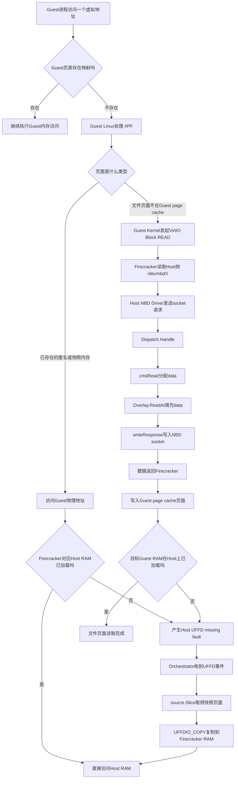

> 妈的 我整不明白 当沙箱（虚拟机）发生一次page fault，机器上到底发生什么，虚拟机page 页面大小，宿主机页面大小？有没有大页设置？这个页面，到底会拷贝几次？

<details><summary>5 previous messages</summary>

> 你这次困惑的根源是“page fault”这个词混了三层：guest 自己的 4 KiB 虚拟内存缺页、Firecracker 恢复快照时的 UFFD 缺页、guest 文件读取导致的 NBD I/O。它们页面大小和拷贝次数都不同。我先从这个版本的 Firecracker 配置、hugetlbfs 和 UFFD mapping 代码把实际值钉死，再分别画出三条路径。
>
> <details><summary>Ran 5 commands</summary>
>
> - Ran `set -o pipefail
> repo='/home/zry/桌面/e2b/e2b-infra/e2b-infra-2026.09'
> cd "$repo"
> printf '%s\n' '[hugepage references orchestrator]'
> rg -n --glob '!vendor/**' -i 'huge.?page|hugetlb|page.?size|mem_backend|memory backend|uffd' packages/orchestrator/internal packages/orchestrator/*.go packages/orchestrator/cmd packages/orchestrator/.env.local packages/orchestrator/Dockerfile | sed -n '1,360p'
> printf '%s\n' '[page/block constants]'
> rg -n -C 4 'PageSize|HugepageSize|RootfsBlockSize|oldMemfileHugePageSize|oldRootfsBlockSize|maxRequestsInProgress' packages/orchestrator/internal packages/shared/pkg/storage/header | sed -n '1,260p'
> printf '%s\n' '[firecracker process/config files candidates]'
> rg -n --glob '!vendor/**' 'EnableHuge|HugePages|hugepages|hugetlbfs|MemBackend|MemoryBackend|uffd' packages/orchestrator/internal/sandbox/fc packages/orchestrator/internal/sandbox | sed -n '1,360p'
> printf '%s\n' '[host runtime page size]'
> getconf PAGESIZE
> uname -a
> printf '%s\n' '[host hugepages current]'
> rg -n 'HugePages|Hugepagesize|Hugetlb' /proc/meminfo
> printf '%s\n' '[host mounts huge]'
> findmnt -t hugetlbfs -o TARGET,SOURCE,FSTYPE,OPTIONS 2>/dev/null || true
> printf '%s\n' '[guest kernel config/build references]'
> rg -n --glob '!vendor/**' 'CONFIG_(PAGE_SIZE|HUGETLB|TRANSPARENT_HUGEPAGE)|vmlinux|kernelVersion' . | sed -n '1,220p'`
> - Ran `set -o pipefail
> repo='/home/zry/桌面/e2b/e2b-infra/e2b-infra-2026.09'
> cd "$repo"
> printf '%s\n' '[machine hugepage config]'
> nl -ba packages/orchestrator/internal/sandbox/fc/client.go | sed -n '220,255p'
> printf '%s\n' '[sandbox config hugepages propagation]'
> nl -ba packages/orchestrator/internal/sandbox/sandbox.go | sed -n '60,80p;315,365p;430,510p;620,690p'
> printf '%s\n' '[template storage source and block size]'
> nl -ba packages/orchestrator/internal/sandbox/template/storage.go | sed -n '1,180p'
> printf '%s\n' '[UFFD mapping handshake]'
> nl -ba packages/orchestrator/internal/sandbox/uffd/uffd.go | sed -n '110,200p'
> nl -ba packages/orchestrator/internal/sandbox/uffd/memory/mapping.go | sed -n '1,125p'
> nl -ba packages/orchestrator/internal/sandbox/uffd/memory/region.go | sed -n '1,90p'
> printf '%s\n' '[fault fetch and UFFD copy]'
> nl -ba packages/orchestrator/internal/sandbox/uffd/userfaultfd/userfaultfd.go | sed -n '205,255p;310,385p'
> nl -ba packages/orchestrator/internal/sandbox/uffd/userfaultfd/fd.go | sed -n '100,135p'
> printf '%s\n' '[machine model huge page enum docs]'
> rg -n -C 5 'HugePagesNr2M|HugePages.*2M|huge_pages' packages/orchestrator/internal/sandbox/fc packages/orchestrator/internal/api packages/orchestrator/vendor/github.com/firecracker-microvm | sed -n '1,220p'`
> - Ran `repo='/home/zry/桌面/e2b/e2b-infra/e2b-infra-2026.09'; cd "$repo"
> printf '%s\n' '[generated FC model huge pages]'
> rg -n -C 8 'MachineConfigurationHugePagesNr2M|HugePages.*json' packages/shared/pkg/fc/models packages/orchestrator | sed -n '1,220p'
> printf '%s\n' '[build File Slice chain]'
> rg -n 'func \(.*\*File\) (Slice|ReadAt)|func NewFile' packages/orchestrator/internal/sandbox/build packages/orchestrator/internal/sandbox/block | sed -n '1,180p'
> nl -ba packages/orchestrator/internal/sandbox/build/file.go 2>/dev/null | sed -n '1,280p'
> printf '%s\n' '[streaming chunk Slice chain]'
> nl -ba packages/orchestrator/internal/sandbox/block/streaming_chunk.go | sed -n '180,265p;360,430p'
> printf '%s\n' '[prefetch copies]'
> nl -ba packages/orchestrator/internal/sandbox/uffd/prefetch/prefetcher.go | sed -n '60,180p'
> printf '%s\n' '[template hugepage metadata paths]'
> rg -n --glob '!vendor/**' 'HugePages:' packages/orchestrator packages/api packages/template-manager | sed -n '1,240p'`
> - Ran `repo='/home/zry/桌面/e2b/e2b-infra/e2b-infra-2026.09'; cd "$repo"
> printf '%s\n' '[build File read/slice]'
> nl -ba packages/orchestrator/internal/sandbox/build/build.go | sed -n '1,135p'
> printf '%s\n' '[header ReadAt/Slice implementation references]'
> rg -n 'func \(.*\) (ReadAt|Slice)\(' packages/orchestrator/internal/sandbox/build packages/orchestrator/internal/sandbox/block | sed -n '1,260p'
> printf '%s\n' '[cache construction for memory source]'
> rg -n -C 8 'NewStreamingChunker|NewCache\(' packages/orchestrator/internal/sandbox/build packages/orchestrator/internal/sandbox/template | sed -n '1,300p'
> printf '%s\n' '[hugepage config API incoming]'
> nl -ba packages/api/internal/orchestrator/create_instance.go | sed -n '215,252p'
> rg -n -C 5 'HasHugePages|hugePages' packages/api/internal | sed -n '1,180p'
> printf '%s\n' '[runtime config stored hugepage]'
> rg -n -C 5 'GetHugePages\(\)|HugePages.*cfg|HugePages.*template' packages/orchestrator/internal packages/api/internal | sed -n '1,260p'`
> - Ran `repo='/home/zry/桌面/e2b/e2b-infra/e2b-infra-2026.09'; cd "$repo"
> printf '%s\n' '[hugepage host provisioning]'
> rg -n --glob '!**/vendor/**' 'nr_hugepages|hugetlbfs|HugePages_Total|vm.nr_hugepages|pagesize=2M' . | sed -n '1,280p'
> printf '%s\n' '[storage diff to streaming chunk]'
> nl -ba packages/orchestrator/internal/sandbox/build/storage_diff.go | sed -n '1,175p'
> printf '%s\n' '[cache mmap allocation]'
> nl -ba packages/orchestrator/internal/sandbox/block/cache.go | sed -n '1,130p'
> printf '%s\n' '[full fetch/local slice]'
> nl -ba packages/orchestrator/internal/sandbox/block/chunk.go | sed -n '70,150p'
> nl -ba packages/orchestrator/internal/sandbox/block/local.go | sed -n '45,100p'
> printf '%s\n' '[uffd prefetch worker exact]'
> nl -ba packages/orchestrator/internal/sandbox/uffd/prefetch/prefetcher.go | sed -n '180,310p'`
>
> </details>
>
> 代码已经把关键配置说明白了：guest 的基础页仍是 4 KiB；`HugePages=true` 只是把 Firecracker 的 guest RAM 在宿主机侧改用 2 MiB hugetlbfs backing。这个版本对 Firecracker ≥1.7 默认传入该开关，因此生产模板通常走 2 MiB UFFD fault 单元，而 rootfs/NBD 仍是 4 KiB block。接下来核对内核 `UFFDIO_COPY` 的精确定义和 Firecracker UFFD 协议，确定“拷贝几次”哪些能精确计数、哪些取决于远端缓存命中。
>
> <details><summary>Ran 4 commands, searched the web</summary>
>
> Searched the web for `site:github.com/firecracker-microvm/firecracker userfaultfd page_size huge_pages 2M snapshot memory backend ...`
>
> Searched the web for `site:github.com/firecracker-microvm/firecracker/blob/main/docs/hugepages.md Firecracker huge pages UFFD ...`
>
> Searched the web for `https://raw.githubusercontent.com/firecracker-microvm/firecracker/main/docs/hugepages.md`
>
> Searched the web for `site:github.com/firecracker-microvm/firecracker src devices virtio block read_exact_at_volatile guest memory ...`
>
> Searched the web for `https://raw.githubusercontent.com/firecracker-microvm/firecracker/v1.7.0/src/vmm/src/devices/virtio/block/device.rs`
>
> - Ran `set -o pipefail
> repo='/home/zry/桌面/e2b/e2b-infra/e2b-infra-2026.09'; cd "$repo"
> printf '%s\n' '[default/current FC version flags]'
> rg -n -C 4 'DefaultFirecrackerVersion|FirecrackerVersionFlag|getFirecrackerVersion' packages/shared packages/api packages/orchestrator | sed -n '1,220p'
> printf '%s\n' '[Firecracker rootfs drive configuration]'
> rg -n --glob '!vendor/**' 'Rootfs|rootfs|Drive|BlockDevice' packages/orchestrator/internal/sandbox/fc | sed -n '1,300p'
> printf '%s\n' '[NBD path passed to Firecracker]'
> rg -n -C 6 'WaitForPath|rootfsProvider|RootfsPath|Rootfs' packages/orchestrator/internal/sandbox/sandbox.go packages/orchestrator/internal/sandbox/fc | sed -n '1,300p'`
>
> - Ran `repo='/home/zry/桌面/e2b/e2b-infra/e2b-infra-2026.09'; cd "$repo"
> printf '%s\n' '[rootfs provider path and FC drive setup]'
> rg -n 'rootfsPath|WaitForPath|RootfsPath|PutGuestDrive|PutGuestBootSource|IoEngine|Drive' packages/orchestrator/internal/sandbox/fc/*.go packages/orchestrator/internal/sandbox/rootfs/*.go | sed -n '1,260p'
> nl -ba packages/orchestrator/internal/sandbox/fc/process.go | sed -n '240,390p'
> nl -ba packages/orchestrator/internal/sandbox/fc/client.go | sed -n '80,175p'`
>
> - Ran `repo='/home/zry/桌面/e2b/e2b-infra/e2b-infra-2026.09'; cd "$repo"; nl -ba packages/orchestrator/internal/sandbox/fc/client.go | sed -n '170,195p'; rg -n -C 6 'IoEngine:' packages/orchestrator/internal/sandbox packages/orchestrator/internal/template | sed -n '1,180p'`
>
> - Ran `repo='/home/zry/桌面/e2b/e2b-infra/e2b-infra-2026.09'; cd "$repo"
> printf '%s\n' '[memory diff block/page size generation]'
> rg -n -C 6 'DiffMetadata|BlockSize|PageSize' packages/orchestrator/internal/sandbox/uffd packages/orchestrator/internal/sandbox/sandbox.go | sed -n '1,320p'
> printf '%s\n' '[host start client huge pool math]'
> nl -ba iac/provider-gcp/nomad-cluster/scripts/start-client.sh | sed -n '105,125p;158,182p'`
>
> </details>
>
> <details><summary>Plan</summary>
>
> 已核对本版本实际配置、Firecracker UFFD handshake、内存源 Slice、UFFDIO_COPY、NBD rootfs链路和宿主机 hugepage provisioning。
>
> - [x] 核对旧版 guest、host、UFFD 与 NBD 的页/块大小配置
> - [x] 追踪一次 UFFD 内存缺页的数据来源和拷贝路径
> - [x] 追踪一次 guest 文件缺页到 NBD 的数据拷贝路径
> - [x] 给出按场景区分的结论和示意图
>
> </details>
</details>

确实绕，因为这里同时存在“guest 页、host 页、Firecracker 内存页、NBD 块、Go buffer”五个概念。先把最重要的一句话钉死：

> `cmdRead` 里的 `data := make(...)` 不是处理 Firecracker 内存缺页的页面；它只是 rootfs NBD 读取的临时响应缓冲区。

## 页面大小分别是什么

| 对象 | 这个项目中的典型大小 |
|---|---:|
| Guest Linux 基础内存页 | 4 KiB |
| Guest 文件 page cache 页 | 通常 4 KiB |
| Host Linux 基础页 | 4 KiB |
| Rootfs Overlay block | 4 KiB |
| Firecracker 普通内存 backing | 4 KiB |
| Firecracker hugepage backing | 2 MiB |
| UFFD 一次加载大小 | 普通模式 4 KiB；大页模式 2 MiB |
| NBD `data` 大小 | `request.Length`，可能4 KiB，也可能更大 |

Guest 地址翻译是：

```text
Guest虚拟地址
  → Guest页表，通常4 KiB粒度
  → Guest物理地址 GPA
  → KVM EPT/NPT
  → Host物理地址
```

地址翻译本身不拷贝数据。

Firecracker 的 2 MiB hugepage 只是宿主机如何承载 guest RAM：

```text
1个Host 2 MiB hugepage
= 承载512个Guest 4 KiB页面
```

它不会把 Guest Linux 的基础页大小变成 2 MiB。

## 这个版本有没有开启大页

有，而且正常 API 创建的沙箱通常会开启。

Firecracker ≥1.7 时，API 设置：

```go
HugePages: true
```

Orchestrator 最终传给 Firecracker：

[client.go:241](./e2b/e2b-infra/e2b-infra-2026.09/packages/orchestrator/internal/sandbox/fc/client.go:241)

```go
if hugePages {
    machineConfig.HugePages =
        models.MachineConfigurationHugePagesNr2M
}
```

也就是：

```json
{
  "huge_pages": "2M"
}
```

生产节点启动脚本还会：

- 挂载 hugetlbfs
- 预留 2 MiB hugepages
- 配置 overcommit hugepages

Firecracker 官方说明，这会用 2 MiB hugetlbfs 页面承载 guest RAM；恢复这种快照必须通过 UFFD，并把实际 page size 发送给 UFFD handler。[Firecracker hugepage 文档](https://raw.githubusercontent.com/firecracker-microvm/firecracker/main/docs/hugepages.md)

但当前这台开发机的状态是：

```text
Host基础页：4096字节
Hugepagesize：2048 KiB
HugePages_Total：0
```

即挂载了 hugetlbfs，但当前没有预留 hugepage。生产节点配置与这台开发机不同。

## “虚拟机发生一次 page fault”可能是两件事



### 第一种：Firecracker 内存 UFFD fault

这是恢复快照后的 lazy memory loading。

Guest 或 Firecracker 访问的 Guest RAM 尚未在宿主机物理内存中，于是 Host kernel 产生 UFFD event：

```text
Host UFFD fault
→ Orchestrator userfaultfd.Serve
→ faultPage
→ memfile.Slice
→ UFFDIO_COPY
→ Firecracker guest RAM
```

代码是：

[userfaultfd.go:334](./e2b/e2b-infra/e2b-infra-2026.09/packages/orchestrator/internal/sandbox/uffd/userfaultfd/userfaultfd.go:334)

```go
b, err := source.Slice(ctx, offset, int64(pagesize))
```

然后：

[userfaultfd.go:358](./e2b/e2b-infra/e2b-infra-2026.09/packages/orchestrator/internal/sandbox/uffd/userfaultfd/userfaultfd.go:358)

```go
copyErr := u.fd.copy(addr, pagesize, b, copyMode)
```

内部执行：

```text
ioctl(UFFDIO_COPY)
```

Linux 内核定义 `UFFDIO_COPY` 为把 userspace 现有页面内容原子复制到 missing page。[Linux userfaultfd 文档](https://docs.kernel.org/6.6/admin-guide/mm/userfaultfd.html#resolving-userfaults)

如果启用了 hugepage：

```text
Guest只访问其中一个4 KiB页面
→ Host产生一次2 MiB UFFD fault
→ Orchestrator读取2 MiB
→ UFFDIO_COPY复制2 MiB
→ 一次加载512个Guest基础页
```

## UFFD 内存缺页拷贝几次

### 本地 memfile cache 命中

`source.Slice()` 直接返回 mmap slice，不复制；随后 `UFFDIO_COPY`：

```text
本地memfile cache mmap
    --一次2 MiB复制-->
Firecracker guest RAM
```

所以：

- 普通页模式：1 次 × 4 KiB
- hugepage 模式：1 次 × 2 MiB

CPU随后读取这个页面不算“数据拷贝”。

### 远端 cache miss

StreamingChunker 首先从远端填入本地 mmap：

```text
远端/GCS
→ 本地template cache mmap
→ UFFDIO_COPY
→ Firecracker RAM
```

至少：

1. 远端流进入本地 mmap。
2. mmap 通过 `UFFDIO_COPY` 进入 Firecracker RAM。

所以最少 2 次；TLS、HTTP、Go SDK 内部可能还有额外中间复制，不能只从 Orchestrator 代码精确计算。

## 第二种：Guest 文件页面缺失

浏览器读取二进制、动态库、字体时，Guest page cache 没有对应文件页：

```text
Guest文件缺页
→ Guest Kernel VirtIO Block READ
→ Firecracker读取/dev/nbdX
→ NBD Dispatch.cmdRead
→ Overlay.ReadAt
```

这才会执行：

```go
data := make([]byte, length)
```

大致的数据路径：

```text
rootfs/template cache mmap
    ↓ copy 1
Go heap上的data
    ↓ copy 2
Unix socket内核缓冲区
    ↓ copy 3
NBD请求目标，也就是Firecracker的Guest RAM
```

本地 cache 命中时至少有 3 次请求数据复制：

1. Overlay/cache → Go `data`
2. Go `data` → Unix socket kernel buffer
3. socket/NBD → Firecracker 的 Guest RAM目标区域

具体是 3 次还是更多，取决于 Firecracker Sync/Async IO engine、`O_DIRECT`、Linux NBD bio 和 socket 实现，但前两次在当前 Orchestrator 代码中是确定存在的。

如果 Guest RAM 的目标区域本身还没有被 UFFD 加载，就会额外发生：

```text
先UFFDIO_COPY整个2 MiB旧内存
→ 然后NBD把4 KiB文件数据覆盖进去
```

这是一个非常关键的放大：

```text
Guest只想读取4 KiB文件页
→ 可能先加载2 MiB快照内存
→ 再走一次4 KiB NBD读取
```

## 最终结论

一次所谓的“沙箱 page fault”没有固定拷贝次数：

| 场景 | 最小数据拷贝 |
|---|---:|
| Guest页表缺失，但Host RAM已存在 | 可能0次，只建立映射 |
| UFFD普通页，本地memfile命中 | 1次 × 4 KiB |
| UFFD hugepage，本地memfile命中 | 1次 × 2 MiB |
| UFFD hugepage，远端cache miss | 至少2次 × 2 MiB |
| Guest文件页缺失，NBD本地cache命中 | 至少3次 × NBD请求长度 |
| Guest文件页缺失，同时目标RAM也UFFD missing | NBD至少3次，再加1次UFFD，且UFFD可能复制2 MiB |

而你当前分析的：

```go
data := make([]byte, length)
```

只属于“NBD rootfs 文件读取”这一条链，不属于 UFFD 快照内存页面本身。

最需要警惕的组合是：

```text
浏览器启动
→ 大量Guest文件页缺失
→ 大量NBD cmdRead分配
→ 同时大量Guest RAM区域发生2 MiB UFFD fault
→ NBD分配/GC + 2 MiB内存加载同时抢CPU和内存带宽
```

这比单独分析 NBD 或单独分析 UFFD 更接近 16/32 沙箱并发时的实际瓶颈。
